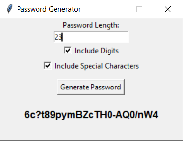

# Password Generator

This project is a random password generator using the Tkinter library for the graphical user interface (GUI). The application allows users to generate passwords based on selected criteria, such as length and inclusion of special characters.

<p align="center">
  
</p>

## Project Structure

- `src/`: Contains the source code for the application.
  - `app/`: Core application code.
    - `__init__.py`: Package initializer.
    - `main.py`: Entry point of the application.
    - `generator.py`: Contains the password generation logic.
    - `gui.py`: Manages the GUI using Tkinter.
- `tests/`: Contains unit tests for the application.
  - `__init__.py`: Package initializer.
  - `test_generator.py`: Unit tests for the password generation logic.

## Prerequisites

- **Python 3.x**: Ensure you have Python 3.x installed on your system.
- **Tkinter**: Tkinter is included with Python installations on most platforms. Verify that Tkinter is installed by running the following command:

```sh
python -m tkinter
```

## Usage

Navigate to the src directory:

```sh
cd src
```

Run the application:

```sh
python -m src.app.main
```

## Running Tests

This command will discover and run all the tests located in the tests/ directory.

```sh
python -m unittest discover -s tests
```

## Note: Tkinter is part of the Python standard library and does not need to be installed via pip. Ensure your Python environment includes Tkinter.
